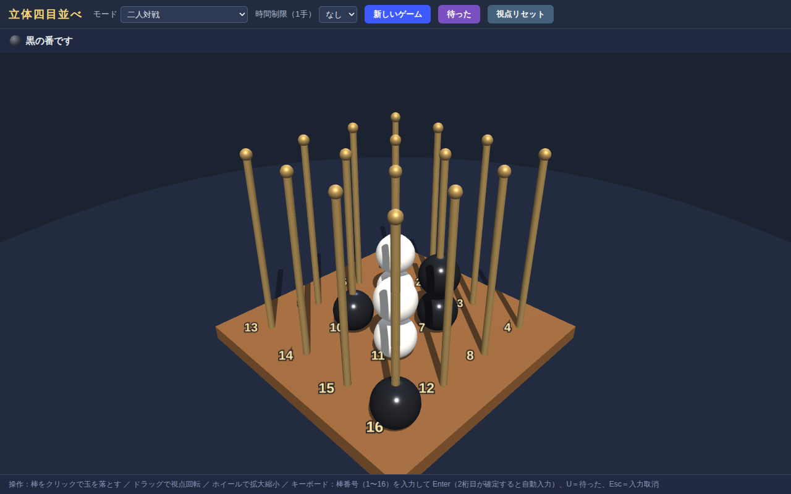
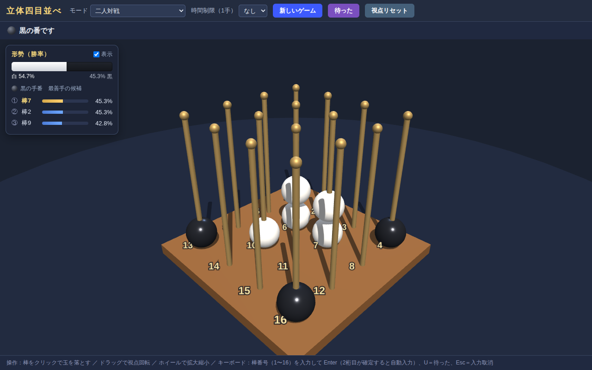

# 立体四目並べ（Score Four）

ブラウザで遊べる 3D の立体四目並べです。4×4 に並んだ 16 本の棒に玉を落とし、
縦・横・斜め・立体対角線のいずれかに自分の色の玉を 4 つ並べたら勝ちです。



## 遊び方

- `index.html` をブラウザで開くだけで遊べます（ビルド・サーバー不要）。
  - ローカルサーバーを使う場合: `python3 -m http.server 8000` → http://localhost:8000
- 先手が **白**、後手が **黒**。交互に棒を選んで玉を落とします。
- 玉は重力に従い、その棒のいちばん下の空きマスまで落ちます（1 本の棒に最大 4 個）。
- どちらかが 1 列（4 つ）揃えた時点でゲーム終了です。

## ルール上の補足（勝利ラインの数）

4×4×4 の格子内で一直線に 4 マス並ぶ組み合わせは、機械的に全列挙すると
**76 通り**です（垂直 16 ＋ 各段の縦・横・斜め 40 ＋ 垂直面の斜め 16 ＋ 立体対角線 4）。
本プログラムは全直線を自動列挙して判定しているため、判定漏れはありません。

## 操作方法

| 操作 | 内容 |
|---|---|
| 棒にカーソルを合わせる | 落下位置に半透明の玉をプレビュー |
| クリック | その棒に玉を落とす |
| ドラッグ | 視点を回転 |
| マウスホイール | ズームイン / ズームアウト |
| 数字キー（1〜16）→ Enter | 番号の棒に玉を落とす（2 桁目が確定すると自動入力） |
| U キー / 「待った」ボタン | 1 手戻す（CPU 戦では自分の手番まで戻る） |
| Esc | 番号入力の取り消し |
| 「視点リセット」 | カメラを初期位置に戻す |
| 「棋譜」ボタン | 棋譜を表示（コピー / ファイル保存） |
| 「🔊 音」ボタン | 効果音の ON/OFF |

各棒の足元には番号ラベル（1〜16）が表示されています。

## 機能

- **二人対戦** と **CPU 対戦**（先手 / 後手を選択可能）
- CPU の強さは 4 段階
  - レベル1: 即勝ち・即負け防止のみ考えるランダム
  - レベル2: 2 手読み（ミニマックス）
  - レベル3: 思考時間 約 5 秒の本格探索
  - レベル4: 思考時間 最大 50 秒の本格探索（1 手 1 分以内）
- レベル3・4 は専用の思考エンジン（`js/engine.js`）を Web Worker 上で実行
  - 反復深化 + αβ 探索（時間いっぱいまで読みを深める。中盤で深さ 12〜15 程度）
  - **ビットボード**: 盤面 64 マスを 32bit × 2 ワードで表現し、
    「占有マス」「各列の着地マス」「リーチマス（埋めると 4 連が完成するマス）」
    を着手のたびに差分更新。即勝ち・受け強制・両狙い（ダブルリーチ）の判定が
    `リーチマス AND 着地マス` の数命令のビット演算で済み、探索速度は
    約 200 万局面/秒（従来比 約 2 倍 = 同じ持ち時間で約 1 手深く読める）
  - 置換表（Zobrist ハッシュ、約 200 万エントリ）
  - キラームーブ / 履歴ヒューリスティックによる枝刈りの最適化
  - ラインごとの玉数を 1 バイトにパックして差分更新する軽量評価関数
  - **T ポイント評価**: 定跡書（山本, 2026「重力付き3次元4目並べは後手不敗である」）
    の形勢判断を評価関数に組み込み。3 段目（z=2）で直下が空の決勝点
    （T ポイント）は白のものなら白勝ち含み、黒のものなら白の有無に関わらず
    黒勝ち含みとして大きく評価し、重複 T ポイントは 1 つ目が白・2 つ目が黒に
    味方する。黒の偶数段の浮き決勝点にも加点（終盤の埋め合いの権利）
  - 受けが 1 通りの局面は深さを消費せず読み進めるため、詰み筋の発見が速い
  - **序盤定跡データベース**: 同定跡書の並行オープニング本線
    W(0,0) B(3,3) W(3,0) B(0,3) W(1,0) B(2,0) W(1,3) に対する
    8 手目の正着 **B(1,0)** をはじめ、8 手目の悪手（(1,1), (1,2), (2,0), (2,3)）を
    とがめる白の攻め筋、W(1,0,1) への黒の改良手 B(0,0,1)、白が 5 手目で
    本線を外した場合の B(1,3) 型の受けを収録。局面キー（盤面の 8 対称 +
    手順前後に対応）で照合するため、鏡像・回転・別手順でも定跡が効く。
    定跡外の序盤 4 手は隅（コーナー）に置く
  - 思考中も UI は固まらず、状況（深さ・経過秒・探索局面数）を表示
  - 1 手の時間制限を設定した場合、思考時間は自動的に制限内へ収まる
  - 形勢（勝率）表示も同じエンジンの `analyze` を専用 Worker で呼び出し、
    人間の手番ごとに現局面を解析して勝率と候補手トップ3を算出（対戦の
    思考とは別スレッドなので CPU の読みを妨げない）
- **1 手ごとの時間制限**（なし / 10 秒 / 30 秒 / 60 秒）。時間切れはその場で負け
- **待った（Undo）**: 何手でも戻せます。勝敗確定後にも戻せます
- **直前に打った玉を強調**: 最後に着手した玉がオレンジ色に光り、盤面の
  どこに打たれたか一目で分かります（待った・新規ゲームにも追従）
- **効果音**: 玉が盤に当たると打点音が鳴ります（白は高め・黒は低めで区別）。
  勝利時にはアルペジオが鳴ります。Web Audio で合成しており音声ファイルは不要。
  ツールバーの「🔊 音」ボタンで ON/OFF できます
- **棋譜（対局記録）**: 対局が終わると（対局中でも）ツールバーの「棋譜」ボタン、
  または終了ダイアログの「棋譜を見る」から棋譜を表示でき、クリップボードへ
  コピー、またはテキストファイルとして保存できます
- **形勢（勝率）表示**: 将棋ソフトのように、現局面の勝率バー（白 vs 黒）と、
  評価の高い候補手トップ3をそれぞれの勝率つきで表示（画面左上パネル、
  「表示」チェックで ON/OFF）。勝率は思考エンジンの評価値をロジスティック
  関数で 0〜100% に変換したもので、詰みを読み切ると 100%（または 0%）になる
- 勝利時は揃った 4 つの玉が光り、ラインを貫くビームを表示



## 構成

```
index.html      … 画面と UI
css/style.css   … スタイル
js/main.js      … ゲームロジック・3D 描画・CPU レベル1/2（依存なしの素の JS）
js/engine.js    … CPU レベル3/4 の思考エンジン（Web Worker 上で実行）
lib/three.min.js… Three.js r147（同梱・MIT License）
```
